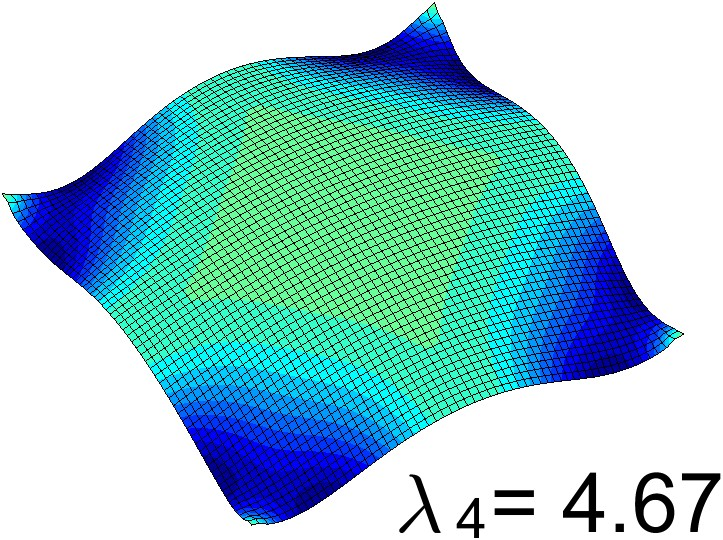

# PyStruct - Fast 3D Structural Analysis Tool

PyStruct is a high-performance Python-based tool for parametric modeling and structural analysis, specifically optimized for 3D beam elements. The tool combines efficient numerical computations with interactive visualization capabilities.

> **Research Publication**: 
> 
> "Topology optimisation of double-layer grid structures with stability constraints"
>
> This software implements topology optimization for double-layer grid structures with:
> - Density-based optimization methodology
> - Stability constraint handling
> - Geometric nonlinear analysis
> - Support for various structural configurations
>
> The tool was developed to implement and validate the optimization methodology presented in the research.

## Key Features

### 1. Modeling Capabilities
- Parametric 3D beam element modeling
- Support for various cross-sections (I-beam, rectangular, circular, etc.)
- Material library with customizable properties
- Node and element generation with automatic mesh refinement
- Boundary condition specification (fixed, pinned, roller supports)
- Load case definition (point loads, distributed loads, moments)

### 2. Analysis Features
- Linear static analysis
- Modal analysis for dynamic properties
- Eigenvalue buckling analysis
  - Critical load factor computation
  - Buckling mode shapes visualization
  - Load combination effects
  - Geometric nonlinearity consideration
  - Interactive buckling mode animation
- Stress and strain calculations
- Internal force diagrams (shear, moment, axial, torsion)
- Displacement visualization
- Support reaction computation

### 3. Performance Optimization
- Algebraic Multigrid (AMG) solver implementation
- Sparse matrix operations for memory efficiency
- Parallel computing support for large-scale analyses
- Memory-optimized data structures
- Real-time computation capabilities

### 4. Visualization and UI
- 3D interactive visualization using VTK
- Real-time model manipulation
- Results post-processing and visualization
- Deformed shape animation
- Stress contour plotting
- Export capabilities (CAD formats, reports)

## Technical Architecture

### Core Components

1. **Geometry Module**
   - Node and element definition
   - Mesh generation
   - Geometric transformations
   - Cross-section properties calculator

2. **Analysis Engine**
   - Stiffness matrix assembly
   - Load vector generation
   - AMG solver implementation
   - Results computation

3. **Visualization Engine**
   - VTK integration
   - Interactive 3D rendering
   - Results visualization
   - User interface components

4. **Analysis Types**
   - Linear static analysis
   - Modal analysis
   - Eigenvalue buckling analysis
     - Geometric stiffness matrix formulation
     - Eigenvalue solver implementation
     - Critical load factor computation
     - Mode shape extraction
   - Results post-processing

5. **Data Management**
   - Input/output handling
   - Results storage
   - Model persistence
   - Format conversion

## Implementation Plan

### Phase 1: Core Framework
1. Set up project structure and dependencies
2. Implement basic geometry classes
3. Create fundamental matrix operations
4. Develop basic beam element formulation

### Phase 2: Analysis Engine
1. Implement global stiffness matrix assembly
2. Develop AMG solver integration
3. Add basic load case handling
4. Create displacement solver

### Phase 3: Visualization
1. Set up VTK environment
2. Implement basic 3D rendering
3. Add interactive model manipulation
4. Create results visualization

### Phase 4: Optimization
1. Implement sparse matrix operations
2. Optimize memory usage
3. Add parallel computing capabilities
4. Performance testing and tuning

### Phase 5: Advanced Features
1. Add advanced analysis types
   - Implement eigenvalue buckling analysis
   - Add geometric stiffness matrix computation
   - Develop buckling mode shape extraction
   - Create buckling load factor solver
2. Implement additional element types
3. Create reporting system
4. Add export capabilities

## Dependencies
- NumPy: Numerical computations
- SciPy: Scientific computing and sparse matrix operations
- Pandas: Data manipulation and analysis
- VTK: 3D visualization
- PyAMG: Algebraic multigrid solver
- PyQt/PySide: GUI framework (optional)

## Installation
```bash
pip install -r requirements.txt
```

## Usage

### Basic Static Analysis
```python
import pystruct

# Create a new model
model = pystruct.Model()

# Add nodes and elements
model.add_node(0, 0, 0)
model.add_node(0, 0, 3000)
model.add_beam_element(1, 2, 'IPE200')

# Add supports and loads
model.add_fixed_support(1)
model.add_point_load(2, Fz=-10000)

# Run analysis
results = model.analyze()

# Visualize results
model.show_results()
```

### Eigenvalue Buckling Analysis
```python
import pystruct

# Create a new model
model = pystruct.Model()

# Add nodes and elements
n1 = model.add_node(0, 0, 0)
n2 = model.add_node(0, 0, 3000)
model.add_beam_element(n1, n2, 'IPE200')

# Add supports
model.add_fixed_support(n1)
model.add_pinned_support(n2)

# Add reference loads for buckling
model.add_point_load(n2, Fy=-100000)  # Axial compression

# Run buckling analysis
buckling_results = model.analyze_buckling(num_modes=3)

# Print critical loads
for i, factor in enumerate(buckling_results['load_factors'], 1):
    print(f"Mode {i} critical load factor: {factor:.2f}")
    print(f"Critical load: {factor * 100:.2f} kN")

# Visualize buckling modes
model.show_buckling_modes(scale=50)  # Scale deformation for visibility
```

### Combined Loading Buckling Analysis
```python
# Add combined loading case
model.add_point_load(n2, Fy=-100000)  # Axial load
model.add_point_load(n2, Fz=10000)    # Lateral load
model.add_moment(n2, My=5000000)      # Bending moment

# Run buckling analysis with combined loading
buckling_results = model.analyze_buckling(
    num_modes=2,
    consider_geometric_nonlinearity=True
)

# Show interaction diagram
model.plot_interaction_diagram()
```

## Demo Cases

### Case Study 1: Cold-formed Steel Built-up I-section Column

#### Full Structure Analysis

*Full structural model of the built-up I-section column*

#### Component Analysis
<div style="display: flex; justify-content: space-between;">
    <div style="flex: 1; margin-right: 10px;">
        
        <p><em>Top chord analysis</em></p>
    </div>
    <div style="flex: 1; margin-right: 10px;">
        
        <p><em>Web member analysis</em></p>
    </div>
    <div style="flex: 1;">
        
        <p><em>Bottom chord analysis</em></p>
    </div>
</div>

#### Buckling Mode Analysis
<div style="display: flex; flex-wrap: wrap; justify-content: space-between;">
    <div style="flex: 1; min-width: 45%; margin: 10px;">
        
        <p><em>First buckling mode</em></p>
    </div>
    <div style="flex: 1; min-width: 45%; margin: 10px;">
        
        <p><em>Second buckling mode</em></p>
    </div>
    <div style="flex: 1; min-width: 45%; margin: 10px;">
        
        <p><em>Third buckling mode</em></p>
    </div>
    <div style="flex: 1; min-width: 45%; margin: 10px;">
        
        <p><em>Fourth buckling mode</em></p>
    </div>
</div>

### Case Study 2: Modified Design Configuration

#### Full Structure Analysis

*Modified design configuration of the built-up I-section column*

#### Component Analysis
<div style="display: flex; justify-content: space-between;">
    <div style="flex: 1; margin-right: 10px;">
        
        <p><em>Modified top chord analysis</em></p>
    </div>
    <div style="flex: 1; margin-right: 10px;">
        
        <p><em>Modified web member analysis</em></p>
    </div>
    <div style="flex: 1;">
        
        <p><em>Modified bottom chord analysis</em></p>
    </div>
</div>

#### Buckling Mode Analysis
<div style="display: flex; flex-wrap: wrap; justify-content: space-between;">
    <div style="flex: 1; min-width: 45%; margin: 10px;">
        
        <p><em>First buckling mode of modified design</em></p>
    </div>
    <div style="flex: 1; min-width: 45%; margin: 10px;">
        
        <p><em>Second buckling mode of modified design</em></p>
    </div>
    <div style="flex: 1; min-width: 45%; margin: 10px;">
        
        <p><em>Third buckling mode of modified design</em></p>
    </div>
    <div style="flex: 1; min-width: 45%; margin: 10px;">
        
        <p><em>Fourth buckling mode of modified design</em></p>
    </div>
</div>

## Contributing
Contributions are welcome! Please read our contributing guidelines and code of conduct.

## Citations and Acknowledgments

This project builds upon established theoretical foundations and is inspired by several existing works in the field of structural analysis. Key references include:

### Theoretical Foundations
1. Cook, R.D., Malkus, D.S., Plesha, M.E., & Witt, R.J. (2001). Concepts and Applications of Finite Element Analysis (4th ed.). Wiley. ISBN: 978-0471356059
   - Beam element formulation and matrix methods

2. Zienkiewicz, O.C., Taylor, R.L., & Zhu, J.Z. (2013). The Finite Element Method: Its Basis and Fundamentals. Butterworth-Heinemann. ISBN: 978-1856176330
   - AMG solver implementation concepts


### Software Acknowledgments
- VTK (Visualization Toolkit): Used for 3D visualization capabilities
- PyAMG: Inspiration for algebraic multigrid solver implementation
- NumPy/SciPy: Core numerical computation libraries

## License
This project is licensed under the MIT License - see the LICENSE file for details. 